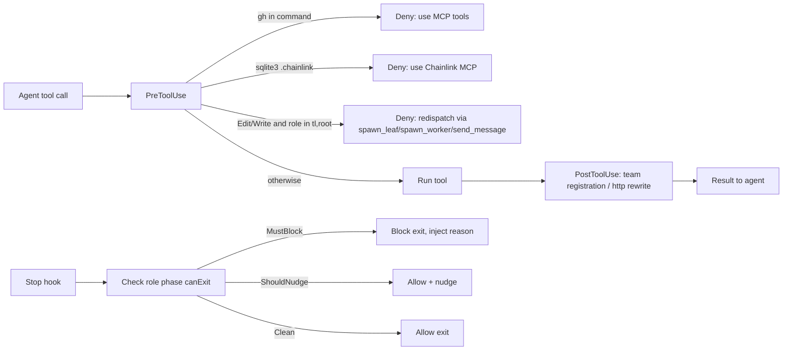
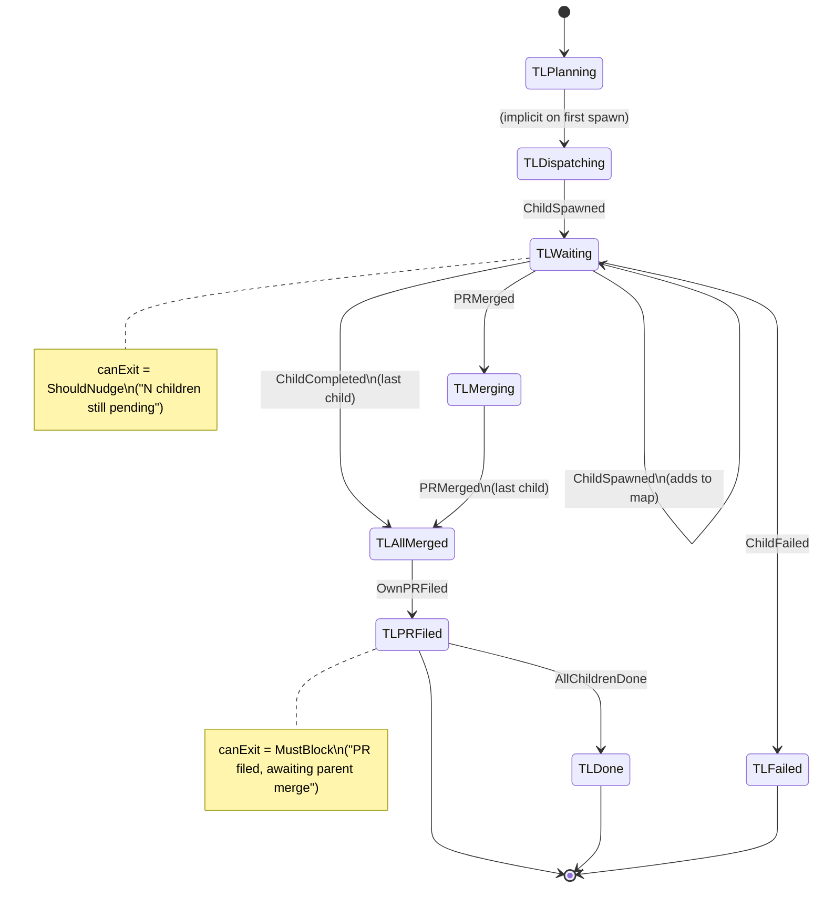
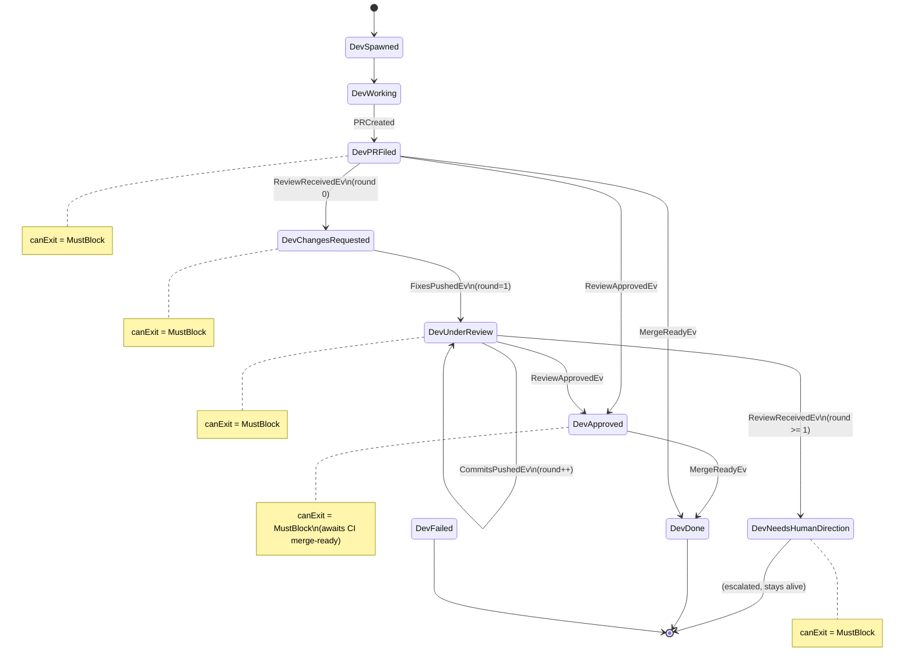
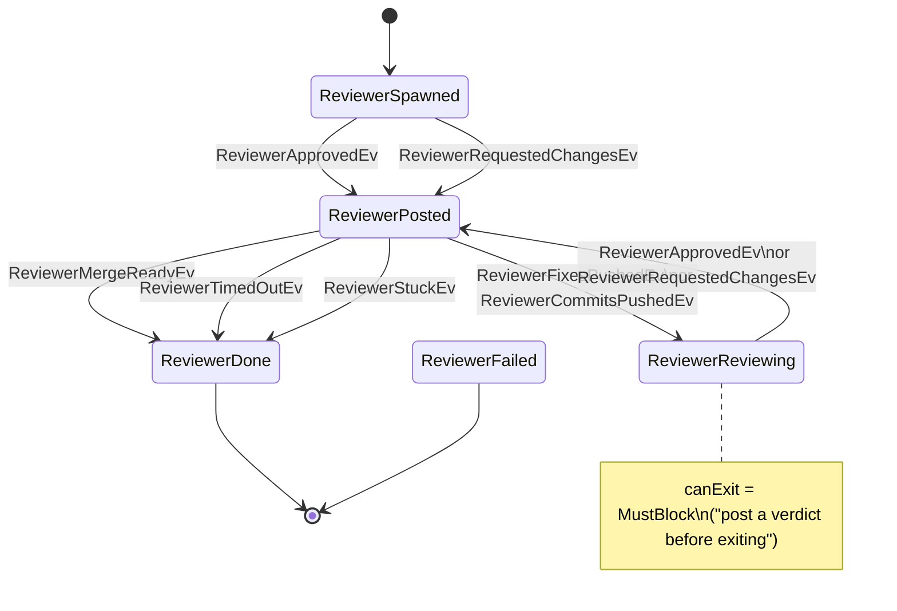
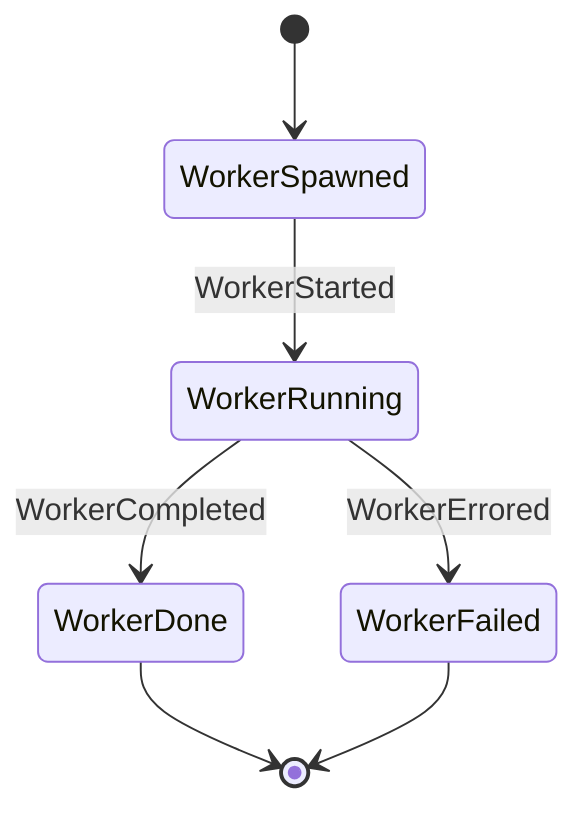
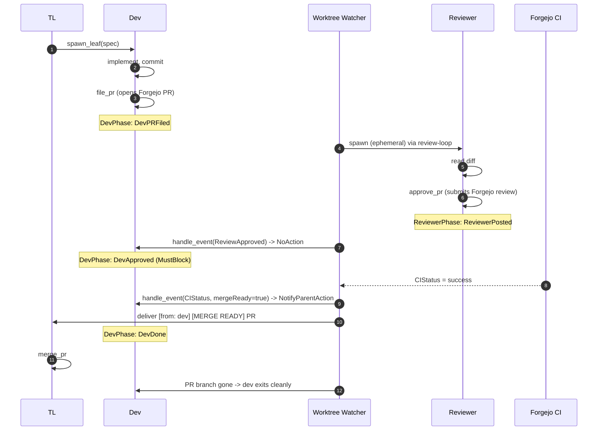
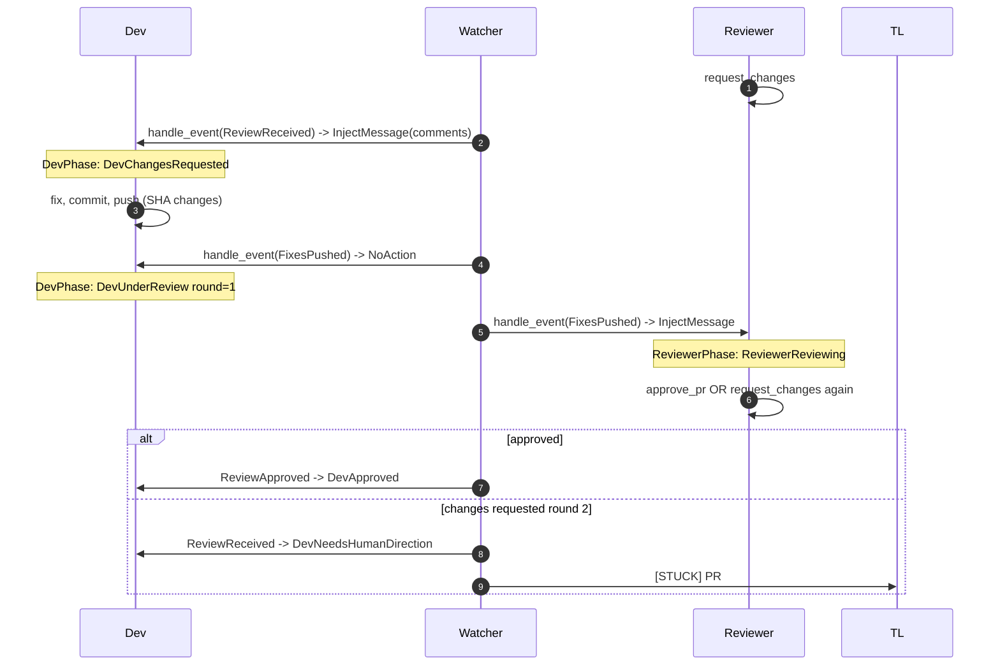
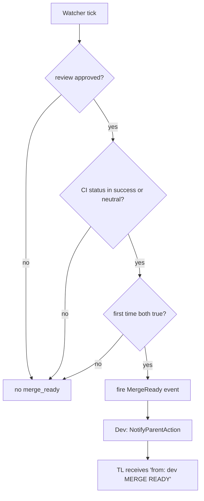

# Agent System Reference

Authoritative reference for ExoMonad's agent system: per-role tool matrix, per-role hook rules, per-role state machines, and the PR review convergence flow.

Sources of truth (read these if any diagram drifts):

- Roles: `.exo/roles/devswarm/{Root,TL,Dev,Reviewer,Worker}Role.hs`
- Phases: `.exo/roles/devswarm/{TLPhase,WorkerPhase}.hs`, `.exo/lib/{DevPhase,ReviewerPhase}.hs`
- Hook policy: `.exo/lib/HookPolicy.hs`, `.exo/lib/HttpDevHooks.hs`
- PR review handlers: `.exo/lib/PRReviewHandler.hs`, reviewer-side in `ReviewerRole.hs`
- Watcher (event source): `rust/exomonad-core/src/services/worktree_event_watcher.rs`
- Review policy knobs: `.exo/review-policy.toml`

---

## 1. Agent Triad and Roles

Five roles. Each agent is `worktree + context-window + actor`, born and torn down together.

| Role | Model | Spawns | Files PR | Merges PR | Lifecycle |
|------|-------|--------|----------|-----------|-----------|
| `root` | Opus | yes | no | yes | persistent (TL window) |
| `tl` | Opus | yes | yes | yes | per-subtree |
| `dev` | Codex / Gemini / OpenCode | no | yes | no | per-spec, exits at merge-ready |
| `reviewer` | Codex / Gemini | no | no | no | ephemeral per review round |
| `worker` | Codex / Gemini | no | no | no | ephemeral, same-worktree edits |

---

## 2. Tool Matrix — role × MCP tool

`x` = registered for that role (callable). Blank = not registered, calls return `tool not found`.

### ExoMonad orchestration tools

| Tool | root | tl | dev | reviewer | worker |
|------|:----:|:--:|:---:|:--------:|:------:|
| `fork_wave` | x | x | | | |
| `spawn_leaf` | x | x | | | |
| `spawn_codex` | x | x | | | |
| `spawn_worker` | x | x | | | |
| `spawn_reviewer` | x | x | | | |
| `close_worker_pane` | x | x | | | |
| `close_issue_and_cleanup` | x | x | | | |
| `cleanup_reviewer_leaf` | x | x | | | |
| `restart_review` | x | x | | | |
| `cleanup_orphan` | x | x | | | |
| `watcher_pr_state` | x | x | | | |
| `file_pr` | | x | x | | |
| `merge_pr` | x | x | | | |
| `notify_parent` | | x | x | | x |
| `send_tmux_message` / `send_mailbox_message` | x | x | x | | x |
| `session_status` | x | x | | | |
| `poll_workers` | x | x | | | |
| `task_list` / `task_get` / `task_update` | | | x | | x |
| `approve_pr` | | | | x | |
| `request_changes` | | | | x | |
| `post_review_comment` | | | | x | |

### Chainlink tools

| Chainlink tool | root | tl | dev | reviewer | worker |
|---------------|:----:|:--:|:---:|:--------:|:------:|
| `chainlink_issue_create` | x | x | | | |
| `chainlink_subissue_create` | x | x | x | | |
| `chainlink_subissue_close` | | | x | | |
| `chainlink_issue_list` | x | x | | | |
| `chainlink_issue_show` | x | x | x | | x |
| `chainlink_issue_update` | x | x | | | |
| `chainlink_issue_comment` | x | x | x | | x |
| `chainlink_issue_close` | x | x | | | |
| `chainlink_issue_block` | x | x | | | |
| `chainlink_issue_relate` | x | x | | | |
| `chainlink_issue_cascade` | x | x | | | |
| `chainlink_milestone_create` / `_list` | x | x | | | |
| `chainlink_session_start` | x | x | x | | x |
| `chainlink_session_work` | x | x | x | | x |
| `chainlink_session_status` | x | x | x | | |
| `chainlink_session_end` | x | x | x | | x |
| `chainlink_timer_start` / `_stop` / `_status` | x | x | | | |

Authority summary: **issue decomposition and lifecycle authority lives at the TL/root layer; dev and worker can read and comment but cannot create top-level issues, close them, or own timers.**

### Messaging inboxes

Message delivery is serialized per recipient. Claude Code uses its native Teams inbox and InboxPoller. Codex, Gemini tmux fallback, OpenCode, and future runtimes without a native inbox route through ExoMonad's per-agent FIFO inbox with one consumer task per agent; see [cross-runtime-message-inbox.md](../decisions/cross-runtime-message-inbox.md).

---

## 3. Hook Rules — per role

### PreToolUse deny matrix

| Rule | root | tl | dev | reviewer | worker |
|------|:----:|:--:|:---:|:--------:|:------:|
| Deny `Edit` / `Write` / `MultiEdit` / `NotebookEdit` (redispatch nudge) | x | x | | | |
| Deny `Bash(gh …)` (force MCP tools) | x | x | x | x | x |
| Deny `Bash(sqlite3 .chainlink/…)` / direct `.chainlink/issues.db` access | x | x | x | x | x |
| Dev-specific HTTP-context rewriting | | | x | | |

The TL/root deny carries this exact redispatch message so the agent retries through `send_message` or a fresh `spawn_leaf` / `spawn_worker` instead of writing files itself.

### Other hooks

| Hook | root | tl | dev | reviewer | worker |
|------|------|----|-----|----------|--------|
| `SessionStart` | default (team register) | default | default | default | default |
| `PostToolUse` | team registration | team registration | http rewriting | none | none |
| `Stop` / `SubagentStop` | allow | `tlStopCheck` (blocks if children pending) | `DevPhase.canExit` | `reviewerStopCheck` (blocks if `ReviewerReviewing`) | `workerStopCheck` |
| `BeforeModel` / `AfterModel` | allow | allow | http rewriting | allow | allow |
| Event handlers | `prReviewEventHandlers` | `prReviewEventHandlers` | `prReviewEventHandlers` | `reviewerEventHandlers` | default |

---

## 4. Per-role State Machines

State persisted in KV per `birth-branch`. Transitions fire from tool handlers and from event handlers.

### TLPhase

### DevPhase

Round vocabulary is zero-based and tied to reviewer verdicts. Round 0 is the first reviewer verdict after the PR is filed. If that verdict requests changes, the dev fixes and pushes; `FixesPushedEv` moves the dev to `DevUnderReview` with `review_round=1`. A second `ReviewReceivedEv` in round 1 transitions to `DevNeedsHumanDirection`, and the handler notifies the TL with `[STUCK: PR #N]`. That is an in-band human-clarification signal, not a watcher health failure and not a Chainlink `review-stuck` issue.

### ReviewerPhase

### WorkerPhase

Worker has no `canExit` guards — workers are ephemeral and may end at any time.

---

## 5. PR Review Convergence Flow

This is the loop the watcher + dev + reviewer + TL collectively run. The watcher is the only place that observes the world (filesystem, CI, time). Every other actor reacts to events the watcher dispatches.

### Sequence — happy path

### Sequence — fixes-pushed loop

### Event vocabulary (Rust watcher -> WASM handler)

These are the `PRReviewEvent` constructors the watcher emits. Each role's `prReviewEventHandlers` decides what to do with them.

| Event | Watcher trigger | Dev/TL handler | Reviewer handler |
|-------|-----------------|----------------|------------------|
| `ReviewReceived` | new Forgejo review comments | log + `ReviewReceivedEv` + inject comments | log + `ReviewerRequestedChangesEv` + inject |
| `ReviewApproved` | review state = approved | `ReviewApprovedEv` -> `DevApproved` | `ReviewerApprovedEv` -> `ReviewerPosted` |
| `ReviewerApproved` | reviewer agent set verdict approved | same as above | same as above |
| `ReviewerRequestedChanges` | reviewer wrote requested-changes verdict | `ReviewReceivedEv` (one fix round) | `ReviewerRequestedChangesEv` |
| `FixesPushed` | SHA change after `changes_requested` | `FixesPushedEv` -> round++ | inject `[FIXES PUSHED]` to re-review |
| `CommitsPushed` | SHA change outside the changes-requested window | `CommitsPushedEv` -> round++ | `ReviewerCommitsPushedEv` |
| `ReviewTimeout` | no reviewer response within `reviewer_max_wait_seconds` | log only | `ReviewerTimedOutEv` -> Done |
| `MergeReady` | reviewer approval AND CI success/neutral both seen | `MergeReadyEv` -> Dev sends `[MERGE READY]` to TL | `ReviewerMergeReadyEv` -> Done |
| `Stuck` | rounds exceed `reviewer_max_rounds` | inject "stay alive, wait for TL" | `ReviewerStuckEv` -> Done |
| `RateLimited` | rate-limit hit | log only | log only |
| `DevNotPushing` / `ReviewerNotResponding` / `ReviewerNeverStarted` / `ReviewDevFailed` | health probes | log only (escalated by watcher to chainlink `review-stuck`) | n/a |

### CI gating — why `MergeReady` requires both

Without Forgejo Actions producing a CI status, `ci_mergeable_at` stays `None` and `MergeReady` never fires even with reviewer approval.

---

## 6. Watcher Escalation Outputs

Beyond per-PR events, the watcher escalates terminal failure modes to **chainlink `review-stuck` issues** rather than re-trying. The TL surface treats those as human-clarification inputs (do not auto-close, do not respawn the dev leaf).

| Watcher signal | Outcome |
|----------------|---------|
| `dev_not_pushing` | open chainlink `review-stuck` issue |
| `reviewer_not_responding` | open chainlink `review-stuck` issue |
| `reviewer_never_started` | open chainlink `review-stuck` issue |
| `dev_failed` | open chainlink `review-stuck` issue |
| `Stuck` (rounds exceeded) | inject "wait for TL", dev moves to `DevNeedsHumanDirection` |

---

## 7. Generated HTML View

A standalone single-file view of every diagram in this doc renders in any browser:

- `docs/architecture/agent-system.html`

Open it directly (no server needed). Update both files together when role behavior changes.
