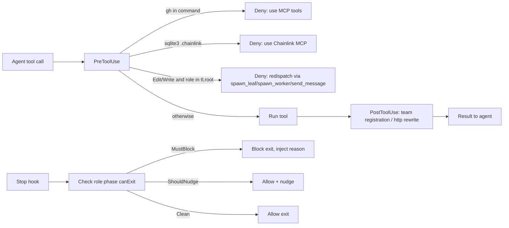
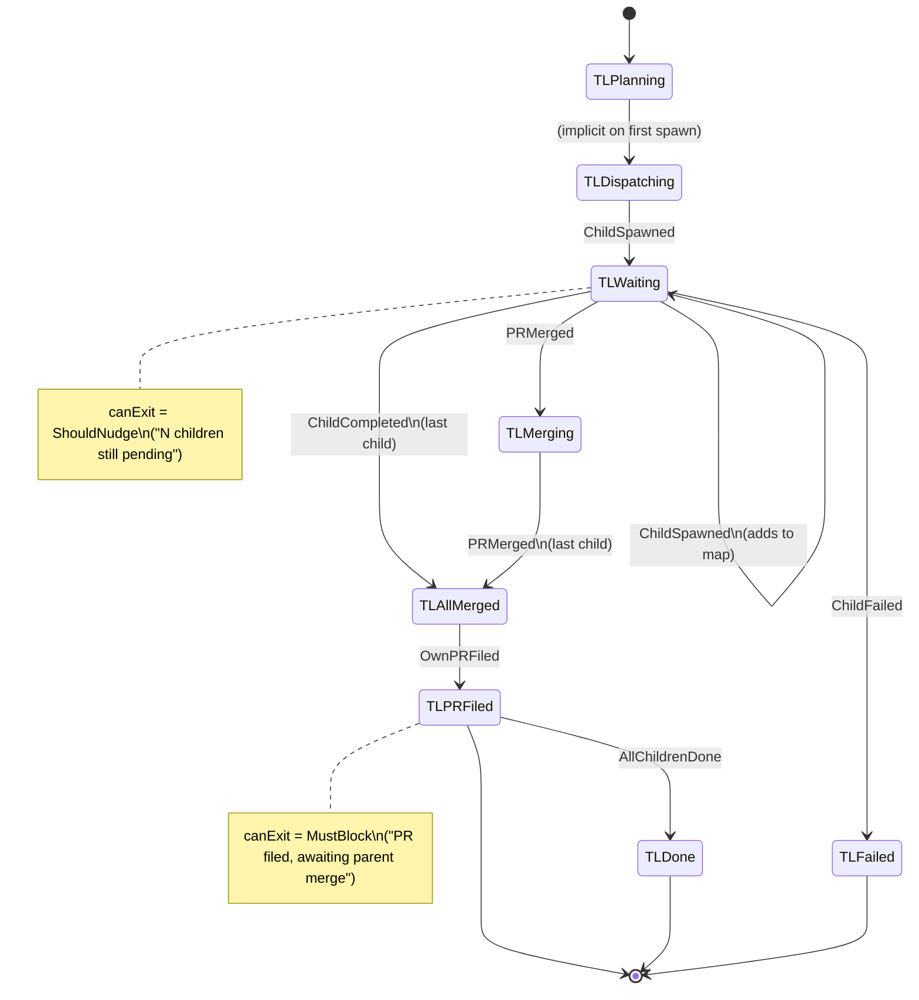
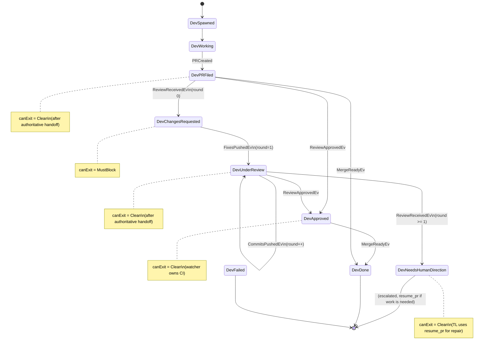
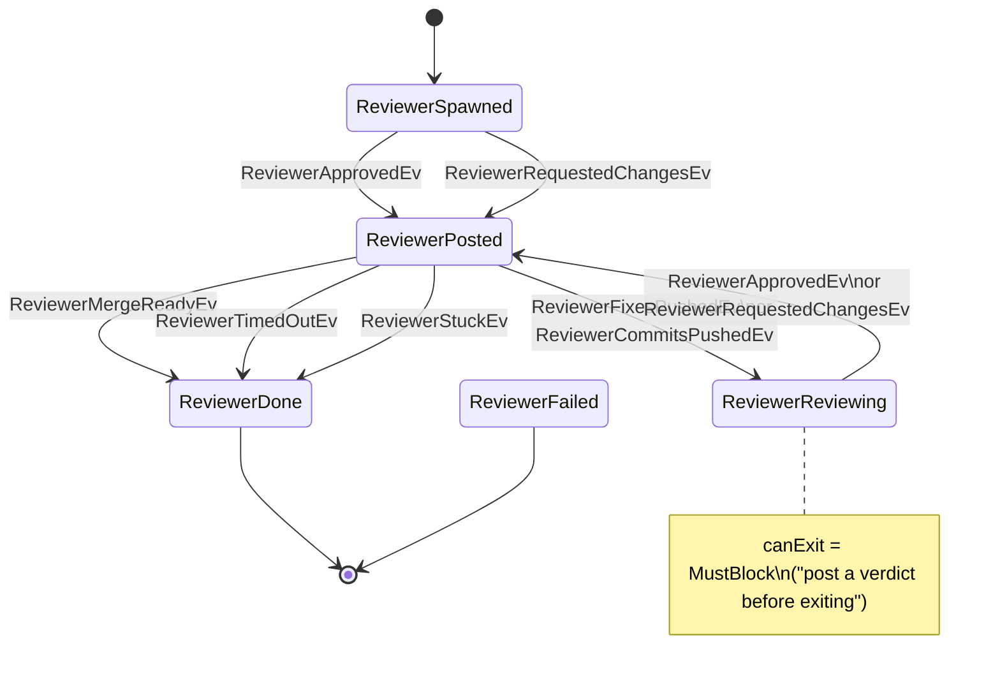
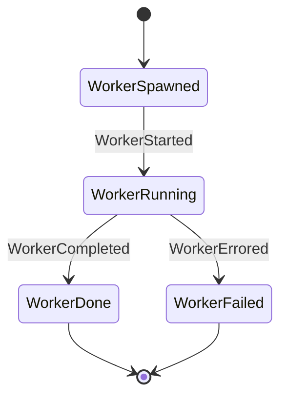
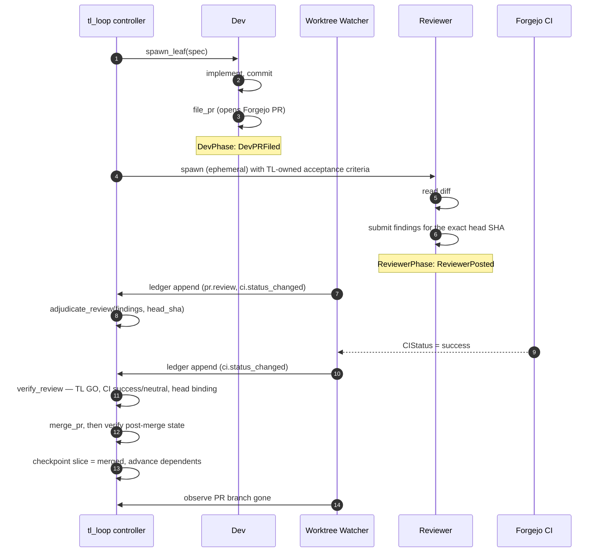
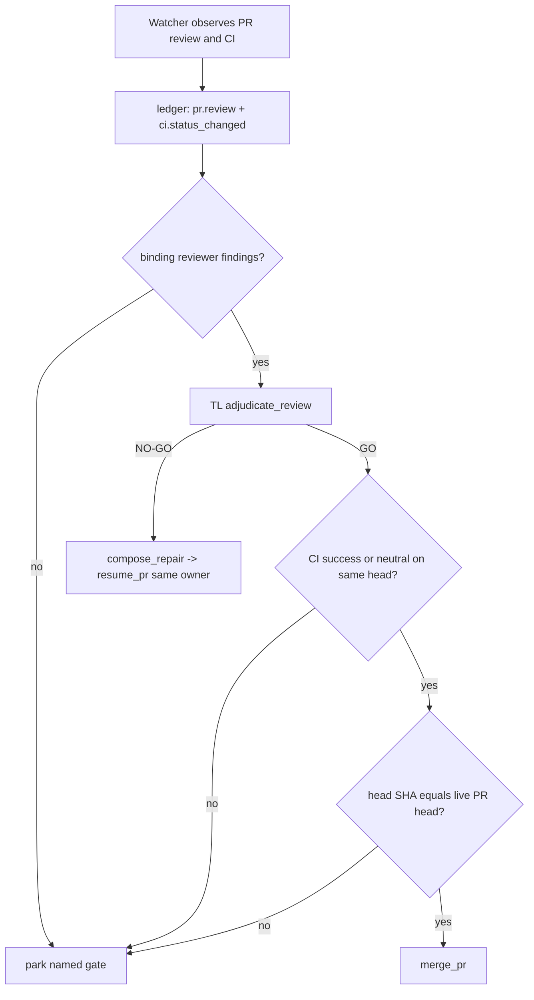
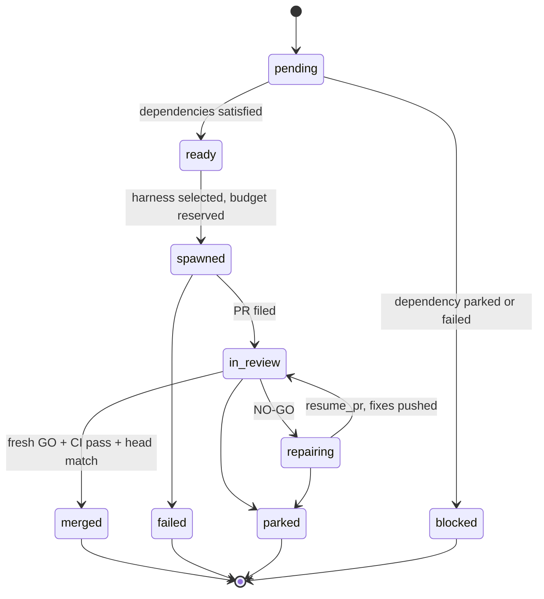

# Agent System Reference

Authoritative reference for ExoMonad's agent system: per-role tool matrix, per-role hook rules, per-role state machines, and the PR review convergence flow.

Sources of truth (read these if any diagram drifts):

- Roles: `.exo/roles/devswarm/{Root,TL,Dev,Reviewer,Worker}Role.hs`
- Phases: `.exo/roles/devswarm/{TLPhase,WorkerPhase}.hs`, `.exo/lib/{DevPhase,ReviewerPhase}.hs`
- Hook policy: `.exo/lib/HookPolicy.hs`, `.exo/lib/HttpDevHooks.hs`
- PR review handlers: `.exo/lib/PRReviewHandler.hs`, reviewer-side in `ReviewerRole.hs`
- Watcher (event source): `rust/exomonad-core/src/services/worktree_event_watcher.rs`
- Review policy knobs: `.exo/review-policy.toml`
- Controller FSM, gates, and merge decisions: `tl_loop/` (see `tl_loop/CLAUDE.md`)
- Harness allowlist and budget ceilings: `.exo/harness_policy.toml`
- Ledger projection consumed by the controller: `tl_loop/events/envelope.py`, `tl_loop/events/reader.py`

For authoring the controller's inputs on a project, see
[Programming the TL](../guides/programming-the-tl.md).

---

## 1. Agent Triad and Roles

Each agent is `worktree + context-window + actor`, born and torn down together.

The coordinator is not one of them. `tl_loop` is a Python controller process — no worktree of its own by default, no context window, no inbox. It calls the same Rust UDS runtime that agents call, and it consumes the immutable ledger rather than messages. The `root` and `tl` **roles** persist as the RPC surface (tool registration, hook policy, event handlers) that the controller and any forked sub-TL branch operate under; they are no longer an interactive session.

| Actor | Model | Spawns | Files PR | Merges PR | Lifecycle |
|-------|-------|--------|----------|-----------|-----------|
| `tl_loop` controller | n/a — Python; calls a model only for `decompose`, `adjudicate_review`, `compose_repair` | yes | via children | yes | one per run; resumable from `.exo/tl-loop/<run_id>/run.json` |
| `root` / `tl` roles | policy-selected from `[roles.tl]` | yes | yes | yes | RPC surface + branch coordinates; a sub-TL is a nested `tl_run`, not a session |
| `dev` | policy-selected from `[roles.worker]` | no | yes | no | one assignment per invocation, exits after handoff |
| `reviewer` | policy-selected from `[roles.reviewer]` | no | no | no | ephemeral per review round |
| `worker` | policy-selected from `[roles.worker]` | no | no | no | ephemeral, same-worktree edits |

Harness and model are never chosen by a plan or a prompt. The selector reads the human-authored allowlist in `.exo/harness_policy.toml` and picks the cheapest allowed entry that meets the slice's capability and budget constraints.

The controller has an architectural no-edit boundary: implementation belongs to leaves and review belongs to reviewers. A failed or stuck run becomes a durable named gate, not a redispatch prompt.

---

## 2. Tool Matrix — role × MCP tool

`x` = registered for that role (callable). Blank = not registered, calls return `tool not found`.

### ExoMonad orchestration tools

| Tool | root | tl | dev | reviewer | worker |
|------|:----:|:--:|:---:|:--------:|:------:|
| `spawn_leaf` | x | x | | | |
| `spawn_codex` | x | x | | | |
| `spawn_worker` | x | x | | | |
| `spawn_reviewer` | x | x | | | |
| `resume_pr` | x | x | | | |
| `close_worker_pane` | x | x | | | |
| `close_issue_and_cleanup` | x | x | | | |
| `cleanup_reviewer_leaf` | x | x | | | |
| `close_reviewer_window` | x | x | | | |
| `restart_review` | x | x | | | |
| `replace_close_pr` | x | x | | | |
| `cleanup_orphan` | x | x | | | |
| `cleanup_leaf` | x | x | | | |
| `watcher_pr_state` | x | x | | | |
| `file_pr` | | x | x | | |
| `merge_pr` | x | x | | | |
| `notify_parent` | | x | x | | x |
| `send_tmux_message` / `send_mailbox_message` | x | x | x | | x |
| `session_status` | x | x | | | |
| `poll_workers` | x | x | | | |
| `check_inbox` | | | x | x | x |
| `emit_controller_event` | | x | | | |
| `list_agents` | x | x | | x | |
| `task_list` / `task_get` / `task_update` | | | x | | x |
| `memory_append` | x | x | x | | x |
| `memory_list` | x | x | x | | x |
| `continuation_brief` | x | x | | | |
| `approve_pr` | | | | x | |
| `request_changes` | | | | x | |
| `post_review_comment` | | | | x | |

### Closed-PR replacement

`replace_close_pr` is the explicit recovery path for a human-approved, closed
and unmerged Forgejo PR. It requires the still-open Chainlink issue, the old
author identity, and a fresh bare leaf slug plus a complete replacement task.
The host validates the old PR metadata, preserves its exact head SHA and source
branch, clears reviewer and watcher state, retires the old coupled identity and
worktree, then creates a new branch from that SHA whose dotted parent is the
old PR base branch. The old PR head is never used as the new PR base.

The operation records durable state in `.exo/replacements/pr-<number>.json`.
Retries return an already-spawned replacement or resume cleanup/spawn after a
partial failure; they never silently reuse a different slug or create a second
replacement. Open PRs must use `restart_review`, merged PRs are rejected, and
the Chainlink issue is never closed by this command.

### Chainlink tools

| Chainlink tool | root | tl | dev | reviewer | worker |
|---------------|:----:|:--:|:---:|:--------:|:------:|
| `chainlink_issue_create` | x | x | | | |
| `chainlink_subissue_create` | x | x | x | | |
| `chainlink_subissue_close` | | | x | | |
| `chainlink_issue_list` | x | x | | | |
| `chainlink_issue_show` | x | x | x | | x |
| `chainlink_issue_update` | x | x | | | |
| `chainlink_issue_comment` | x | x | x | | x |
| `chainlink_issue_close` | x | x | | | |
| `chainlink_issue_block` | x | x | | | |
| `chainlink_issue_relate` | x | x | | | |
| `chainlink_issue_cascade` | x | x | | | |
| `chainlink_milestone_create` / `_list` | x | x | | | |
| `chainlink_session_start` | x | x | x | | x |
| `chainlink_session_work` | x | x | x | | x |
| `chainlink_session_status` | x | x | x | | |
| `chainlink_session_end` | x | x | x | | x |
| `chainlink_timer_start` / `_stop` / `_status` | x | x | | | |

Authority summary: **issue decomposition and lifecycle authority lives at the TL/root layer; dev and worker can read and comment but cannot create top-level issues, close them, or own timers.**

### Messaging inboxes

Message delivery is serialized per recipient. Claude Code uses its native Teams inbox and InboxPoller. Codex tmux fallback, OpenCode, and future runtimes without a native inbox route through ExoMonad's per-agent FIFO inbox with one consumer task per agent; see [cross-runtime-message-inbox.md](../decisions/cross-runtime-message-inbox.md).

**Reserved alias `parent`.** The literal string `parent` is not an agent name — it is a reserved alias meaning "the caller's parent". To reach your parent, call `notify_parent`; never address a message to the literal recipient `parent`. The two delivery entrypoints treat it differently, on purpose: `notify_parent` accepts `parent` as a sentinel and resolves it to the real parent agent before delivery, while `send_message` **rejects** it (peer messaging requires a concrete agent name). No inbox row is ever written under `to_agent = "parent"`.

### Addressing and presentation topics

The operator-control vocabulary is an addressing and presentation layer over
these existing authorities. Its grammar is
`{verb}/{category}/{noun}/{locators}` with the closed verbs `in`, `obs`, and
`signal`. It does not add a broker, listener, event log, inbox, or second
writer. A topic is a name for an existing boundary, not a new way to reach it.

| Topic class | Example | Existing authority | Delivery rule |
|---|---|---|---|
| `in/` | `in/agent/<agent_id>/steering` | M11 durable guidance queue | `enqueue_batch` only; at-least-once and durable |
| `obs/` | `obs/event/pr.review` | Immutable ledger and `event-registry.json` | Droppable view; the event identity is not renamed |
| `signal/` | `signal/park/<run_id>/review_stuck` | `tl_loop` park state and named gates | Immediate presentation; never queued or coalesced |

Path-derived segments percent-encode `+`, `#`, and `%` as uppercase `%2B`,
`%23`, and `%25`. `/` remains the level separator, so it is rejected inside a
segment. There is no `out/` topic: the recipient's `in/` queue is the durable
copy. The complete grammar and encoding rules are in
[the operator control-plane decision](../decisions/operator-control-plane.md#topic-grammar-and-encoding).

`obs/` topics are views over existing ledger identities. The checked-in
[`topic-mappings.v1.json`](../observability/topic-mappings.v1.json) catalog and
`just validate-observability-contracts` guard every observation topic against
[`event-registry.json`](../observability/event-registry.json); adding an `obs/`
name never mints an event. `signal/park` exposes a closed park cause so an
operator can see escalation; it does not answer a gate or mutate run state.
Only the controller and its existing control routes can make those decisions.

---

## 3. Hook Rules — per role

### PreToolUse deny matrix

| Rule | root | tl | dev | reviewer | worker |
|------|:----:|:--:|:---:|:--------:|:------:|
| Deny `Edit` / `Write` / `MultiEdit` / `NotebookEdit` (redispatch nudge) | x | x | | | |
| Deny `Bash(gh …)` (force MCP tools) | x | x | x | x | x |
| Deny `Bash(sqlite3 .chainlink/…)` / direct `.chainlink/issues.db` access | x | x | x | x | x |
| Dev-specific HTTP-context rewriting | | | x | | |

The TL/root deny carries this exact redispatch message so the agent retries through `send_message` or a fresh `spawn_leaf` / `spawn_worker` instead of writing files itself.

### Other hooks

| Hook | root | tl | dev | reviewer | worker |
|------|------|----|-----|----------|--------|
| `SessionStart` | default (team register) | default | default | default | default |
| `PostToolUse` | team registration | team registration | http rewriting | none | none |
| `Stop` / `SubagentStop` | allow | allow | `DevPhase.canExit` | `reviewerStopCheck` (blocks if `ReviewerReviewing`) | `workerStopCheck` |
| `BeforeModel` / `AfterModel` | allow | allow | http rewriting | allow | allow |
| Event handlers | `prReviewEventHandlers` | `prReviewEventHandlers` | `prReviewEventHandlers` | `reviewerEventHandlers` | default |

The TL role has no coordination stop hook. The programmatic loop's terminal
predicate is the sole TL completion mechanism; the worker and reviewer stop
checks remain lifecycle-specific and unchanged.


```mermaid
flowchart LR
  call[Agent tool call] --> Pre[PreToolUse]
  Pre -->|gh in command| DenyGh[Deny: use MCP tools]
  Pre -->|sqlite3 .chainlink| DenyDb[Deny: use Chainlink MCP]
  Pre -->|Edit/Write and role in tl,root| DenyImpl[Deny: redispatch via spawn_leaf/spawn_worker/send_message]
  Pre -->|otherwise| Run[Run tool]
  Run --> Post[PostToolUse: team registration / http rewrite]
  Post --> Done[Result to agent]
  Stop[Stop hook] --> SM[Check role phase canExit]
  SM -->|MustBlock| Block[Block exit, inject reason]
  SM -->|ShouldNudge| Nudge[Allow + nudge]
  SM -->|Clean| Allow[Allow exit]
```

---

## 4. Per-role State Machines

State is persisted in KV per `birth-branch` only for roles that invoke the state-machine persistence helpers. Root, dev, reviewer, and worker lifecycle state remains in WASM; the programmatic `tl` role is an RPC surface with no persisted TL phase.

### TLPhase (golden parity and root compatibility)

`TLPhase.hs` remains the Haskell source of truth for the Python FSM golden
fixture and is retained for the legacy `root` role. The programmatic `tl`
role does not import it or call `applyEvent`; its transition and terminal state
lives in `tl_loop`.


```mermaid
stateDiagram-v2
  [*] --> TLPlanning
  TLPlanning --> TLDispatching: (implicit on first spawn)
  TLDispatching --> TLWaiting: ChildSpawned
  TLWaiting --> TLWaiting: ChildSpawned\n(adds to map)
  TLWaiting --> TLAllMerged: ChildCompleted\n(last child)
  TLWaiting --> TLMerging: PRMerged
  TLMerging --> TLAllMerged: PRMerged\n(last child)
  TLAllMerged --> TLPRFiled: OwnPRFiled
  TLPRFiled --> TLDone: AllChildrenDone
  TLWaiting --> TLFailed: ChildFailed
  TLPRFiled --> [*]
  TLDone --> [*]
  TLFailed --> [*]

  note right of TLWaiting: canExit = ShouldNudge\n("N children still pending")
  note right of TLPRFiled: canExit = MustBlock\n("PR filed, awaiting parent merge")
```

### DevPhase


```mermaid
stateDiagram-v2
  [*] --> DevSpawned
  DevSpawned --> DevWorking
  DevWorking --> DevPRFiled: PRCreated
  DevPRFiled --> DevChangesRequested: ReviewReceivedEv\n(round 0)
  DevPRFiled --> DevApproved: ReviewApprovedEv
  DevChangesRequested --> DevUnderReview: FixesPushedEv\n(round=1)
  DevUnderReview --> DevUnderReview: CommitsPushedEv\n(round++)
  DevUnderReview --> DevApproved: ReviewApprovedEv
  DevUnderReview --> DevNeedsHumanDirection: ReviewReceivedEv\n(round >= 1)
  DevApproved --> DevDone: MergeReadyEv
  DevPRFiled --> DevDone: MergeReadyEv
  DevNeedsHumanDirection --> [*]: (escalated, resume_pr if work is needed)
  DevDone --> [*]
  DevFailed --> [*]

  note right of DevChangesRequested: canExit = MustBlock
  note right of DevPRFiled: canExit = Clean\n(after authoritative handoff)
  note right of DevUnderReview: canExit = Clean\n(after authoritative handoff)
  note right of DevApproved: canExit = Clean\n(watcher owns CI)
  note right of DevNeedsHumanDirection: canExit = Clean\n(TL uses resume_pr for repair)
```

Round vocabulary is zero-based and tied to reviewer verdicts. Round 0 is the first reviewer verdict after the PR is filed. If that verdict requests changes, the dev fixes and pushes; `FixesPushedEv` moves the dev to `DevUnderReview` with `review_round=1`. A second `ReviewReceivedEv` in round 1 transitions to `DevNeedsHumanDirection`, and the handler notifies the TL with `[STUCK: PR #N]`. That is an in-band human-clarification signal, not a watcher health failure and not a Chainlink `review-stuck` issue.

### ReviewerPhase


```mermaid
stateDiagram-v2
  [*] --> ReviewerSpawned
  ReviewerSpawned --> ReviewerPosted: ReviewerApprovedEv
  ReviewerSpawned --> ReviewerPosted: ReviewerRequestedChangesEv
  ReviewerPosted --> ReviewerReviewing: ReviewerFixesPushedEv\nor ReviewerCommitsPushedEv
  ReviewerReviewing --> ReviewerPosted: ReviewerApprovedEv\nor ReviewerRequestedChangesEv
  ReviewerPosted --> ReviewerDone: ReviewerMergeReadyEv
  ReviewerPosted --> ReviewerDone: ReviewerTimedOutEv
  ReviewerPosted --> ReviewerDone: ReviewerStuckEv
  ReviewerDone --> [*]
  ReviewerFailed --> [*]

  note right of ReviewerReviewing: canExit = MustBlock\n("post a verdict before exiting")
```

### WorkerPhase


```mermaid
stateDiagram-v2
  [*] --> WorkerSpawned
  WorkerSpawned --> WorkerRunning: WorkerStarted
  WorkerRunning --> WorkerDone: WorkerCompleted
  WorkerRunning --> WorkerFailed: WorkerErrored
  WorkerDone --> [*]
  WorkerFailed --> [*]
```

Worker has no `canExit` guards — workers are ephemeral and may end at any time.

---

## 5. PR Review Convergence Flow

The TL runs the workflow; the watcher only observes world state (filesystem, CI,
Forgejo, and time). The reviewer supplies binding evidence, the TL adjudicates
that evidence, and the controller owns repair and merge decisions.

Two delivery paths run side by side and must not be confused:

- **Agent-facing**: the watcher calls `handle_event` on the agent's WASM plugin and acts on the returned `EventAction` (`InjectMessage`, `NotifyParent`, `NoAction`). This is how a dev leaf learns it has review comments.
- **Controller-facing**: the same world observations are appended to the immutable ledger at `.exo/ledger/segments/`, and `tl_loop` consumes them by global `run_seq` through a typed projection. This is how the merge decision is made.

The controller does **not** read the inbox for coordination. `[MERGE READY]` arriving as a teammate message is an agent-facing notification; the merge itself is authorized by ledger state plus the reviewed-head SHA binding. A free-form message cannot approve a merge.

### Sequence — happy path


```mermaid
sequenceDiagram
  autonumber
  participant Ctl as tl_loop controller
  participant Dev
  participant Watcher as Worktree Watcher
  participant Reviewer
  participant CI as Forgejo CI

  Ctl->>Dev: spawn_leaf(spec)
  Dev->>Dev: implement, commit
  Dev->>Dev: file_pr (opens Forgejo PR)
  Note over Dev: DevPhase: DevPRFiled
  Ctl->>Reviewer: spawn (ephemeral) with TL-owned acceptance criteria
  Reviewer->>Reviewer: read diff
  Reviewer->>Reviewer: submit findings for the exact head SHA
  Note over Reviewer: ReviewerPhase: ReviewerPosted
  Watcher->>Ctl: ledger append (pr.review, ci.status_changed)
  Ctl->>Ctl: adjudicate_review(findings, head_sha)
  CI-->>Watcher: CIStatus = success
  Watcher->>Ctl: ledger append (ci.status_changed)
  Ctl->>Ctl: verify_review — TL GO, CI success/neutral, head binding
  Ctl->>Ctl: merge_pr, then verify post-merge state
  Ctl->>Ctl: checkpoint slice = merged, advance dependents
  Watcher->>Ctl: observe PR branch gone
```

### Sequence — fixes-pushed loop

```mermaid
sequenceDiagram
  autonumber
  participant Dev
  participant Watcher
  participant Reviewer
  participant Ctl as tl_loop controller

  Reviewer->>Reviewer: submit findings (NO-GO)
  Watcher->>Ctl: ledger append (pr.review)
  Ctl->>Ctl: adjudicate_review -> NO-GO
  Ctl->>Ctl: compose_repair -> resume_pr (same owner/branch/PR)
  Ctl->>Dev: repair guidance through resume_pr
  Dev->>Dev: fix, commit, push (SHA changes)
  Watcher->>Ctl: ledger append (pr.head_changed)
  Ctl->>Reviewer: spawn reviewer for the new head
  alt GO after binding findings
    Ctl->>Ctl: wait for CI on the same head
  else repeated NO-GO or timeout
    Ctl->>Ctl: park named gate; no merge
  end
```

Repair never creates a new branch, leaf name, agent type, or `-2` suffix. `compose_repair` calls `watcher_pr_state` first and requires the PR to be open, unmerged, and identified by both head branch and SHA; it dispatches only through `resume_pr`.

### Event vocabulary (Rust watcher -> WASM handler)

These are the `PRReviewEvent` constructors the watcher emits. Each role's `prReviewEventHandlers` decides what to do with them.

| Event | Watcher trigger | Dev/TL handler | Reviewer handler |
|-------|-----------------|----------------|------------------|
| `ReviewReceived` | new Forgejo review comments | log + `ReviewReceivedEv` + inject comments | log + `ReviewerRequestedChangesEv` + inject |
| `ReviewApproved` | review state = approved | `ReviewApprovedEv` -> `DevApproved` | `ReviewerApprovedEv` -> `ReviewerPosted` |
| `ReviewerApproved` | reviewer agent set verdict approved | same as above | same as above |
| `ReviewerRequestedChanges` | reviewer wrote requested-changes verdict | `ReviewReceivedEv` (one fix round) | `ReviewerRequestedChangesEv` |
| `FixesPushed` | SHA change after `changes_requested` | `FixesPushedEv` -> round++ | inject `[FIXES PUSHED]` to re-review |
| `CommitsPushed` | SHA change outside the changes-requested window | `CommitsPushedEv` -> round++ | `ReviewerCommitsPushedEv` |
| `ReviewTimeout` | no reviewer response within `reviewer_max_wait_seconds` | log only | `ReviewerTimedOutEv` -> Done |
| `MergeReady` | **Deprecated derived state:** inferred from `pr.review` + `ci.status_changed`; not a source event | compatibility notification only; the TL derives merge eligibility | no required handler |
| `Stuck` | rounds exceed `reviewer_max_rounds` | notify upward; controller repairs via `resume_pr` | `ReviewerStuckEv` -> Done |
| `RateLimited` | rate-limit hit | log only | log only |
| `DevNotPushing` / `ReviewerNotResponding` / `ReviewerNeverStarted` / `ReviewDevFailed` | health probes | log only (escalated by watcher to chainlink `review-stuck`) | n/a |

### CI and review evidence


```mermaid
flowchart TD
  A[Watcher observes PR review and CI] --> B[ledger: pr.review + ci.status_changed]
  B --> C{binding reviewer findings?}
  C -- no --> Z[park named gate]
  C -- yes --> D[TL adjudicate_review]
  D -- NO-GO --> R[compose_repair -> resume_pr same owner]
  D -- GO --> E{CI success or neutral on same head?}
  E -- no --> Z
  E -- yes --> F{head SHA equals live PR head?}
  F -- no --> Z
  F -- yes --> G[merge_pr]
```

Without Forgejo Actions producing a CI status, the canonical merge rule cannot
pass even when the TL has adjudicated GO. Review timeout is never approval; it
parks the slice with a named gate.

### Controller-side merge gates

`tl_loop` applies the canonical merge rule before it calls `merge_pr`:

| Gate | Where | Failure mode it prevents |
|------|-------|--------------------------|
| TL adjudicated GO | `tl_loop/rlm/adjudicate.py` consumes binding reviewer findings plus TL-owned criteria; no verdict is invented without reviewer evidence | Merging without a reviewer-evidence-backed workflow decision |
| CI success or neutral | watcher ledger projection for the current head | Merging code that does not satisfy the machine gate |
| Head binding | `tl_loop/loop/review.py` — the reviewed head must equal the live PR head | Approving one commit and merging another |

Optional second-review policy and `GO-WITH-NITS` handling are additional
project policy, not universal approval layers. After merging, the controller
verifies post-merge state before advancing dependent slices.

---

## 6. Watcher Escalation Outputs

Beyond per-PR events, the watcher escalates terminal failure modes to **chainlink `review-stuck` issues** rather than re-trying. These are human-clarification inputs — do not auto-close them and do not respawn the dev leaf.

| Watcher signal | Outcome |
|----------------|---------|
| `dev_not_pushing` | open chainlink `review-stuck` issue |
| `reviewer_not_responding` | open chainlink `review-stuck` issue |
| `reviewer_never_started` | open chainlink `review-stuck` issue |
| `dev_failed` | open chainlink `review-stuck` issue |
| `Stuck` (rounds exceeded) | notify TL; a later repair uses `resume_pr`, dev moves to `DevNeedsHumanDirection` |

---

## 7. Controller Run State and Human Gates

The controller's own state machine is durable at `.exo/tl-loop/<run_id>/run.json`, guarded by the shared writer lock `.exo/tl-loop/run.lock`. A sub-TL nests below its parent's directory.

### Slice lifecycle


```mermaid
stateDiagram-v2
  [*] --> pending
  pending --> ready: dependencies satisfied
  ready --> spawned: harness selected, budget reserved
  spawned --> in_review: PR filed
  in_review --> repairing: NO-GO
  repairing --> in_review: resume_pr, fixes pushed
  in_review --> merged: fresh GO + CI pass + head match
  spawned --> failed
  in_review --> parked
  repairing --> parked
  pending --> blocked: dependency parked or failed
  merged --> [*]
  failed --> [*]
  parked --> [*]
  blocked --> [*]
```

Path ownership is validated across all non-terminal slices: two active slices may not own overlapping `paths` globs.

### Park causes

Every bounded failure ends in one of these, with an auditable cause recorded in `park_audit`. None of them is retried around.

| Cause | Trigger | Human action |
|-------|---------|--------------|
| `retries_exhausted` | NO-GO past `escalate_after_attempts` | Re-plan the slice or approve a gate |
| `budget_exhausted` | Role or per-harness ceiling reached | Raise the ceiling deliberately, or narrow the plan |
| `no_capable_harness` | No allowed entry meets the capability requirement | Widen `allow` deliberately |
| `schedule_deadlock` | Nothing dispatchable, or `max_depth` exceeded | Fix plan structure |
| `review_stuck` | Review rounds exceeded without convergence | Read the PR |
| `harness_switch_requested` | Configured harness could not proceed | Approve explicitly; `EXOMONAD_ALLOW_HARNESS_SWITCH=1` |
| `stall_detected` | Dead pane or no progress past the heartbeat threshold | Investigate the worker |

### Answering a gate

```bash
python3 -m tl_loop status --project-root . --run-id root
python3 -m tl_loop gate   --project-root . --run-id root --name <gate> --approve
python3 -m tl_loop gate   --project-root . --run-id root --name <gate> --reject
```

Gates are durable, uniquely named, and tri-state (`pending`, `approved`, `rejected`). The controller resumes from the checkpoint after an answer. It never coaxes a model into continuing and never asks a second interactive coordinator to decide.

---

## 8. Generated HTML View

A standalone single-file view of every diagram in this doc renders in any browser:

- `docs/architecture/agent-system.html`

Open it directly (no server needed). Update both files together when role behavior changes.
